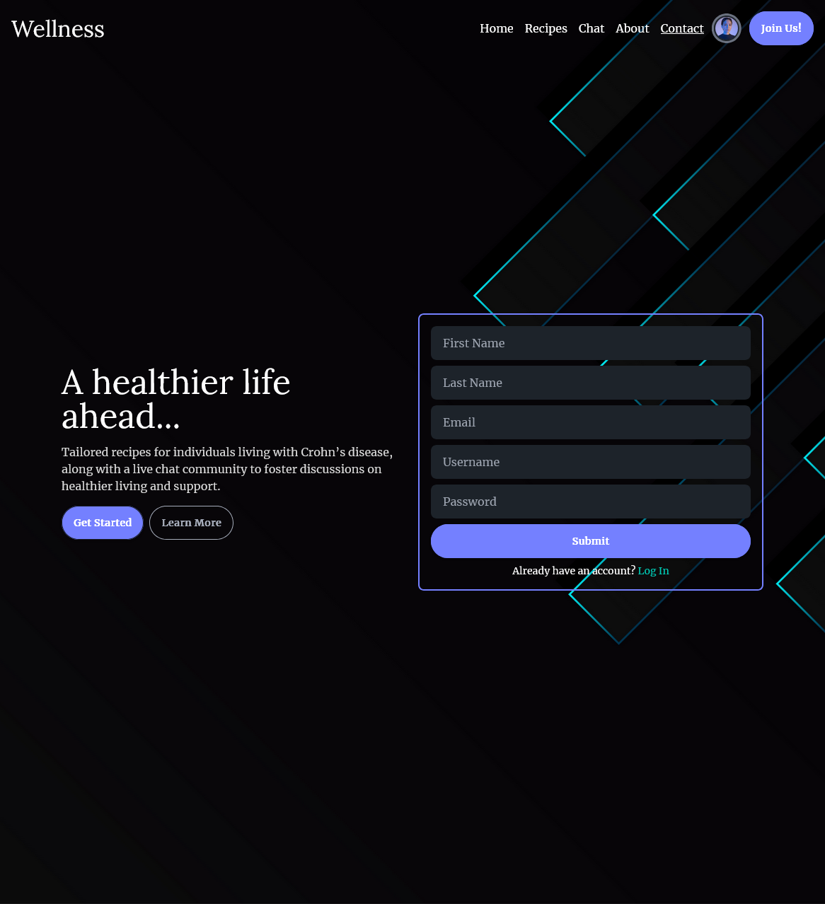
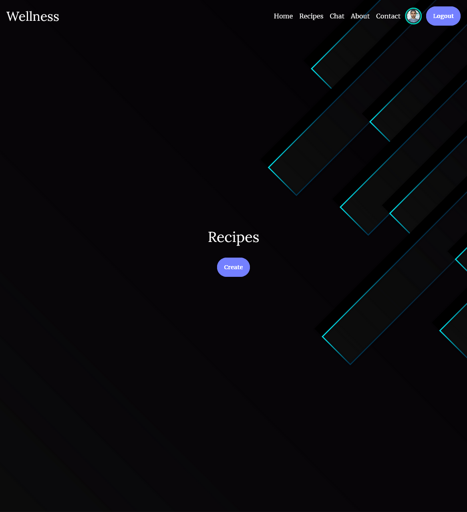

## 🎯 Project Overview

This application empowers users with Crohn’s to manage their food intake more effectively. Through secure authentication and a real-time chat feature, users can share and discuss recipes, tips, and experiences. It combines powerful real-time communication with intuitive recipe management.

## 💡 Key Features

- 🧑‍🍳 Create, read, update, and delete Crohn’s-friendly recipes
- 🔍 Filter or search recipes based on ingredients or tags
- 💬 Real-time group chat for community support and discussion
- 🔐 Secure user authentication with JWT and bcrypt
- 🧭 Seamless navigation using React Router
- ⚡ Global state handled with Zustand
- 🎨 Clean, mobile-first design with Tailwind CSS
- 📦 RESTful API using Express and Mongoose
- 🧑‍💻 MongoDB database with full CRUD operations
- 📨 Real-time communication using Socket.IO
- 🛡️ Protected routes and role-based recipe access

## 🛠️ Technologies Used

### Frontend

- **React 18** — UI Library
- **React Router** — Client-side routing
- **Zustand** — State management
- **Tailwind CSS** — Utility-first styling
- **HTML & JavaScript** — App logic and structure
- **Axios** — HTTP client for API requests

### Backend

- **Node.js + Express** — REST API and Socket server
- **MongoDB + Mongoose** — NoSQL database and ORM
- **Socket.IO** — Real-time chat functionality
- **JWT + bcrypt** — Authentication and password security

## 📸 Screenshots

